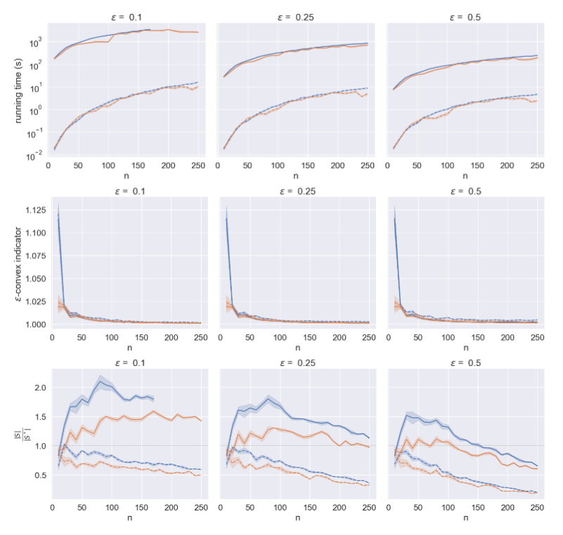
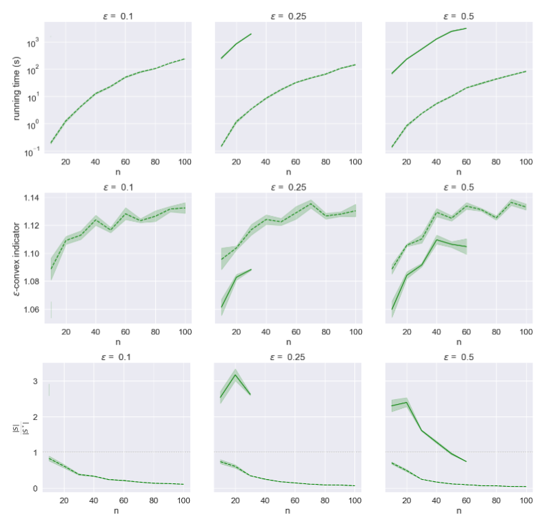

[](https://pubsonline.informs.org/journal/ijoc)

# Efficiently Constructing Convex Approximation Sets in Multiobjective Optimization Problems

This archive is distributed in association with the [INFORMS Journal on
Computing](https://pubsonline.informs.org/journal/ijoc) under the [MIT License](LICENSE).

The software and data in this repository are a snapshot of the software and data
that were used in the research reported on in the paper
[Efficiently Constructing Convex Approximation Sets in Multiobjective Optimization Problems](https://doi.org/10.1287/ijoc.2023.0220) by S. Helfrich, S. Ruzika, and C. Thielen.
The snapshot is based on
[this SHA](https://github.com/StephanHelfrich/molib/commit/f660122672eb3ac1f329c2e44eef555f90c81a0e)
in the development repository.

**Important: This code is being developed on an on-going basis at
https://github.com/StephanHelfrich/molib. Please go there if you would like to
get a more recent version or would like support**

## Cite

To cite the contents of this repository, please cite both the paper and this repo, using their respective DOIs.

https://doi.org/10.1287/ijoc.2023.0220

https://doi.org/10.1287/ijoc.2023.0220.cd

Below is the BibTex for citing this snapshot of the repository.

```
@misc{Helfrich+etal:ConvexApproximationSets,
  author =        {S. Helfrich, S. Ruzika, C. Thielen},
  publisher =     {INFORMS Journal on Computing},
  title =         {{Efficiently Constructing Convex Approximation Sets in Multiobjective Optimization Problems}},
  year =          {2024},
  doi =           {10.1287/ijoc.2023.0220.cd},
  url =           {https://github.com/INFORMSJoC/2023.0220},
  note =          {Available for download at https://github.com/INFORMSJoC/2023.0220},
}
```

## Description

This repository offers a framework for the computation of convex approximation sets in multiobjective optimization problems.

## Dependencies

The following Python (3.11) packages are required to run the algorithms:

- `numpy 1.26.4`
- `pandas 2.1.4`
- `matplotlib 3.8.0`
- `seaborn 0.12.2`
- `func-timeout 4.3.5`
- `networkx 3.1`
- `scipy 1.11.4`

Further, in order to compute the $\varepsilon$-convex indicator (see _Definition 10_), an installation and license of [Gurobi 10.0](https://www.gurobi.com/) and the python package

- `gurobipy 11.0.1`

must be available.

## Data

The data sets used in the computational study of the paper are contained in the folder `instances`. We considered instances of Knapsack Problems as well as Symmetric Metric Traveling Salesman Problems. Details on the construction of these instances can be found in the following subsections.

### Knapsack Instances (Knapsack)

We followed [[1]](#1) and constructed two types of instances:
The first type are uniform instances for which the weight and the $i$-th costs of each item are independently and uniformly sampled as integers in the interval $[0,1000]$, and the capacity is set to half of the total weight of all items rounded up to the nearest integer.

The second type of instances are conflicting instances for which the weight of each item is independently and uniformly sampled as an integer in the interval $[0,1000]$, the capacity is set to half of the total weight of all items rounded up to the nearest integer, and the costs of each item are sampled to be negatively correlated to each other. More precisely, for each item $e$, $f_1(e)$ is an integer uniformly generated in $[0,1000]$, $f_2(e)$ is an integer uniformly distributed in $[1000 - f_1(e)]$, and $f_3(e)$ is an integer uniformly generated in $[\max \{ 900 - f_1(e) - f_2(e), 0  \}, \min \{ 1100 - f_1(e) - f_2(e), 1000 -  f_1(e)\}]$.

For each $n \in \{10,20,\ldots,250\}$ and each type, five $3$-objective knapsack instances are generated.

The files are formatted as follows:

```
d - integer specifying the number of objectives
n - integer specifying the number of items
C - integer specifying the capacity
the next d lines specify the costs of the items as a list of size n, from profit function 1 to d.
the last line specifies the weights of the items as a list of size n.
```

### Symmetric Metric Traveling Salesman Instances (TSP)

We followed [[2]](#2), [[3]](#3), and [[4]](#4) and used the portgen of the DIMACS TSP instance generator (http://archive.dimacs.rutgers.edu/Challenges/TSP/) to obtain, for each $i = 1,2,3$, integer coordinates of cities on a $1000 \times 1000$ square, on the basis of which the $i$-th cost between each two cities is chosen to be the Euclidean distance of their $i$th coordinates.

For each $n \in \{10,20,\ldots,100\}$, five $3$-objective symmetric metric traveling salesman instances are generated.

The files are formatted as follows:

```
Each line contains d+2 values:

city_i city_j c_1(i,j) ... c_d(i,j)
```

## Results

Figure 5 in the paper shows, for each combination of convex approximation algorithms and $\varepsilon \in \\{0.1, 0.25, 0.5\\}$ applied to uniform (orange) and conflicting (blue) triobjective knapsack instances, the the average running time of 10 runs, the $\varepsilon$-convex indicator of the returned set $S$, and the ratio of the cardinality of the set $S$ to the cardinality of the solution set for the weighted sum scalarization obtained by the dual variant of Benson's Outer Approxiamtion Algorithm. Hereby, the results of the GRID method are indicated with solid lines, and the results of the OAA method with dashed lines.



Figure 6 in the paper shows, for each combination of convex approximation algorithms and $\varepsilon \in \\{0.1, 0.25, 0.5\\}$ applied to triobjective symmetric metric traveling salesman instances, the average running time of 10 runs, the $\varepsilon$-convex indicator of the returned set $S$, and the ratio of the cardinality of the set $S$ to the cardinality of the solution set for the weighted sum scalarization obtained by the dual variant of Benson's Outer Approxiamtion Algorithm. Again, the results of the GRID method are indicated with solid lines, and the results of the OAA method with dashed lines.



All experiments have been performed on a computer server equipped with two Intel(R) Xeon(R) CPUs E5-2670 (single processor specifications: nominal speed 2.9GHz, boost up to 3.8GHz, 8 cores, 16 threads, 20MB Cache) and 192GB DDR-3 ECC RAM at 1333MHz using the operating system environment Ubuntu Linux 11. In each run, a time limit of 1 hour has been set.

## Replicating

To replicate the results in Figure 5 and Figure 6, run `run_tsp.py` and `run_knapsack.py`, respectively.

## Ongoing Development

This code is being developed on an on-going basis at the author's
[Github site](https://github.com/StephanHelfrich/molib).

## Support

For support in using this software, submit an
[issue](https://github.com/StephanHelfrich/molib/issues/new).

## References

<a id="1">[1]</a>
C. Bazgan, H. Hugot & D. Vanderpooten (2009).
Implementing an Efficient {FPTAS} for the 0-1 Multi-objective Knapsack Problem.
European Journal of Operational Research, 198(1), pp. 47-56.

<a id="2">[2]</a>
K. Florios and G. Mavrotas (2014).
Generation of the exact pareto set in multi-objective traveling salesman and set covering problems.
Applied Mathematics and Computation 237, pp. 1–19.

<a id="3">[3]</a>
T. Lust and J. Teghem (2009).
Two-phase pareto local search for the biobjective traveling salesman problem.
Journal of Heuristics 16.3, pp. 475–510.

<a id="4">[4]</a>
L. Paquete and T. Stützle (2010).
On the performance of local search for the biobjective traveling salesman problem.
Advances in Multi-Objective Nature Inspired Computing. pp. 143–165.
